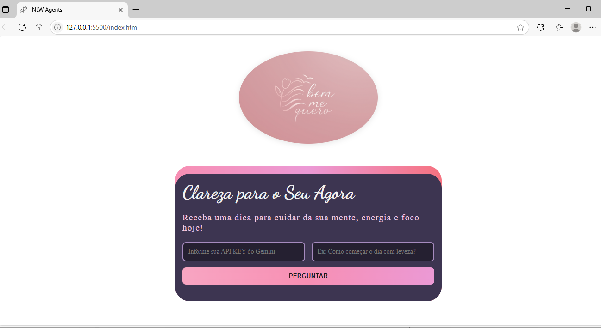
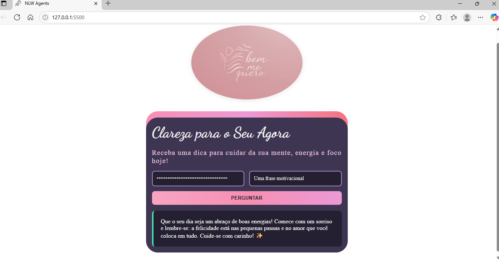

# 💖 Clareza para o Seu Agora — Projeto NLW Agents personalizado

Projeto desenvolvido durante a **NLW (Next Level Week)** da [Rocketseat](https://rocketseat.com.br/), com uma proposta totalmente personalizada para entregar mensagens motivacionais e acolhedoras com o apoio de um agente de Inteligência Artificial.

Este projeto tem como objetivo proporcionar bem-estar, foco e energia positiva para quem busca começar o dia com leveza.

---

## 🌟 Demonstração

🧠 Faça uma pergunta como:
> *"Como posso começar o dia com mais foco?"*

E receba uma resposta personalizada da IA com carinho e intenção.

🚀 [Link do projeto (https://joyce-gomes.github.io/nlw-agents-joyce-edition/)

---

## 🧩 Funcionalidades

- 🔐 Campo para inserir a **API Key do Gemini**
- 💬 Envio de perguntas para um **agente de IA motivacional**
- ✨ Respostas acolhedoras e com limite de até 400 caracteres
- 🎨 Interface estilizada com cores suaves e tipografias encantadoras
- 📱 Design responsivo e animações sutis para melhor experiência

---

## 📚 O que foi aprendido

Durante as 3 aulas da trilha *Discover*, explorei:

### Aula 1 – Fundamentos da Web
- HTML para estruturar páginas
- CSS para estilização com hierarquia e especificidade
- Conceitos como HTTP, IP, DNS e URL

### Aula 2 – Interatividade com JavaScript
- Variáveis, funções e lógica de programação
- Manipulação do DOM
- Formulários dinâmicos e controle de estado (carregando, erro etc.)

### Aula 3 – Integração com IA
- Conceito de **LLMs (Modelos de Linguagem de Grande Escala)**
- Engenharia de Prompt com técnicas como:
  - One-shot
  - Few-shot
  - Chain of Thought
- Uso da API Gemini (Google)

---

## 🛠️ Tecnologias Utilizadas

- HTML5
- CSS3 (com gradientes e responsividade)
- JavaScript (puro)
- [Showdown.js](https://github.com/showdownjs/showdown) — conversão de Markdown para HTML
- Google Gemini API

---

## 🧠 Prompt de IA usado

Você é um assistente motivacional focado em bem-estar emocional, autocuidado e energia positiva para o dia. Responda com mensagens gentis, leves e sinceras, em até 400 caracteres. Pode usar emojis com moderação.

## 🖼️ Preview

## ▶️ Como rodar localmente
bash
Copiar
Editar
# Clone o repositório
git clone https://github.com/seuusuario/nlw-agents-clareza.git

# Acesse a pasta
cd nlw-agents-clareza

Abra o index.html no navegador

# ❤️ Agradecimentos
Agradeço à Rocketseat por proporcionar essa jornada. Essa foi minha forma de aplicar os aprendizados com autenticidade, criatividade e propósito.

Feito com 🌸 por Joyce Gomes dos Santos